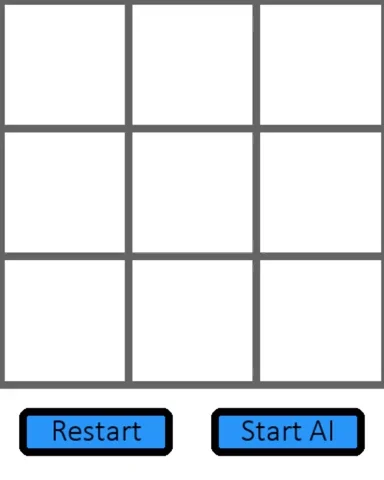
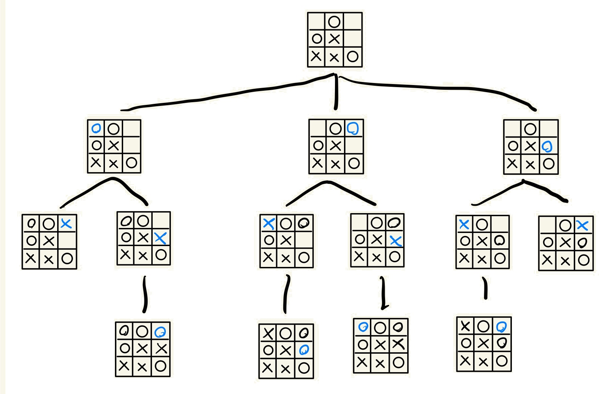
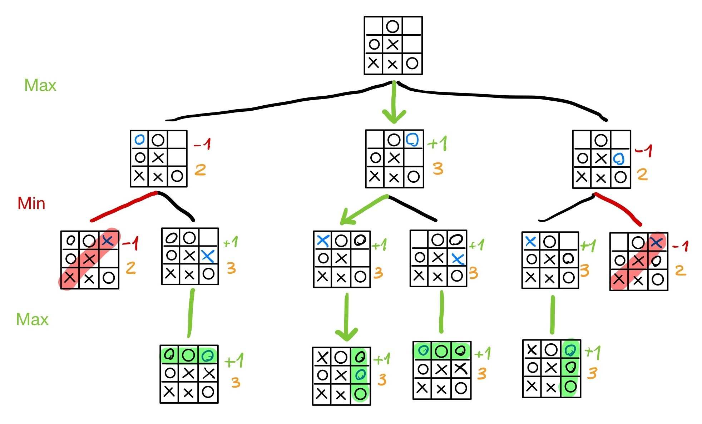

# tic-tac-toe_minimax
An implementation of the Minimax algorithm on Tic-tac-toe game.



## Introduction
This program creates a board where the player is able to play the game Tic-tac-toe (Noughts and crosses) against an AI.  
The game consists of two players who take turns marking the spaces in the grid with **X** or **O**. The first to place their marks in a horitzontal, vertical or diagonal line is the winner.  
The AI uses an algorithm called "Minimax" to find the best move to force a win or, if it's not possible, a draw.

## What is the Minimax algorithm?
Minimax is an artificial intelligence algorithm used in two-player games, such as Tic-tac-toe, Chess or Checkers, that are also zero-sum games. This means that the result is either a win (+1) for one of the players and a loss (-1) for the other, or a draw (0).  

The algorithm works by analyzing all the possible moves that can be made in the current state of the board, considering each player would choose the best move (*min* for the oponent and *max* for the AI), and mark the cell that will lead the AI to the best situation, that, if possible, will be a win.

## The program
There are three main functions used for the AI to make its move: `possible_boards()`, `minimax()` and `move_AI()`.

### possible_boards()
```
def possible_boards(arg_tree, arg_turn):
	if board_status(arg_tree.val) == None:
		boards = []
		for (row,lst) in enumerate(arg_tree.val):
			for (col,val) in enumerate(lst):
				if val == "":
					temp_board = np.copy(arg_tree.val)
					temp_board[row][col] = arg_turn
					boards.append(temp_board)
		for i,sub_board in enumerate(boards):
			arg_tree.add_child(sub_board)
			if arg_turn == "x": temp_turn = "o"
			else: temp_turn = "x"
			arg_tree.childs[i] = possible_boards(arg_tree.childs[i], temp_turn)
	return arg_tree
```
This function takes 2 arguments: a `Tree` object and the current turn. It returns the same `Tree` object but grown, with all possible child boards starting from the original one. 

  

It uses recursion to build the tree, and stops when the state of the child board is a win, a lose or a draw.

### minimax()
```
def minimax(arg_tree, arg_turn, arg_depth=0):
	points = []
	depths = []
	if arg_turn == "x": arg_turn = "o"
	else: arg_turn = "x"
	for i,tmp_child in enumerate(arg_tree.childs):
		point = board_status(tmp_child.val)
		depth = arg_depth
		if point == None:
			if arg_turn == "x":
				point_lst,depth_lst = minimax(tmp_child,arg_turn,arg_depth+1)
				point,depth,_ = choose(point_lst,depth_lst,min)
			else:
				point_lst,depth_lst = minimax(tmp_child,arg_turn,arg_depth+1)
				point,depth,_ = choose(point_lst,depth_lst,max)
		points.append(point)
		depths.append(depth)
	return (points,depths)
```
This function also uses recursion and takes 2 arguments: A `Tree` object and the current turn. There is also an extra argument used to determine the `depth` of a branch in the recursion process. It returns both a list of `points` and a list of `depths` from each child of the parent board of the given `Tree`.  
The algorithm works by giving to the terminal boards a `point` (-1: lose, 0: draw, +1: win) and a `depth`. Then, the parent board of each one will choose a child board from all its children, acording to their points, using the alternating function `min()` or `max()`, and inherit its values `point` and `depth`. If two children have the same points, the parent will choose the one with less depth (that will result in the optimal move to end the game fast).  

  

### move_AI()
```
def move_AI():
	global turn, board
	if np.array_equal(board,empty_board):
		best_moves = [(0,0),(0,2),(2,0),(2,2)]
		pos = best_moves[randint(0,len(best_moves)-1)]
	elif sum(list(row).count("") for row in board) == 8:
		if board[1][1] == "x":
			best_moves = [(0,0),(0,2),(2,0),(2,2)]
			pos = best_moves[randint(0,len(best_moves)-1)]
		else:
			pos = (1,1)
	else:
		boards = possible_boards(Tree(board),turn)
		points,depths = minimax(boards,turn)
		best_move = boards.childs[choose(points,depths,max)[2]].val
		pos = move_pos(board,best_move)
	board[pos[0],pos[1]] = turn
	if turn == "x":
		turn = "o"
	else:
		turn = "x"
```
The function that the AI uses to make its move. It will generally use the minimax algorithm, except in two cases: when the board is empty, the AI will move to a random corner (which is the best starting move in this game); and when there is only one mark in the board, it will move to the center if possible, otherwise to the corners. In these cases it's not optimal to use `minimax()` as it would take too long to check all the possibilities.  

## References
- Wikipedia:  
https://en.wikipedia.org/wiki/Tic-tac-toe  
https://en.wikipedia.org/wiki/Minimax